# Data Structures and Algorithms in Python

This repository's goal is to help you pass your coding interviews by providing a comprehensive collection of data structures and algorithms.

## Contents

**Basic data structures**
- [Array](#array)
- [Linked List](#linked-list)
- [String](#string)
- [Stack](#stack)
- [Queue & Deque](#queue--deque)
- [Hash Map](#hash-map)
- [Hash Set](#hash-set)
- [Matrix](#matrix)

**Tree data structures**
- [Binary Tree](#binary-tree)
- [Binary Search Tree](#binary-search-tree)
- [Heap / Priority Queue](#heap--priority-queue)

**Graph**

**Advanced Data Structure**
- [Trie](#trie)

**Complex Data Structure**

**Algorithms**
- [Two Pointers Technique](#two-pointers-technique)

## Data Structures

---

### Array

Python does not have a built-in array type like other languages, similar functionality can be achieved using lists. Unlike arrays, lists can store mixed data types.

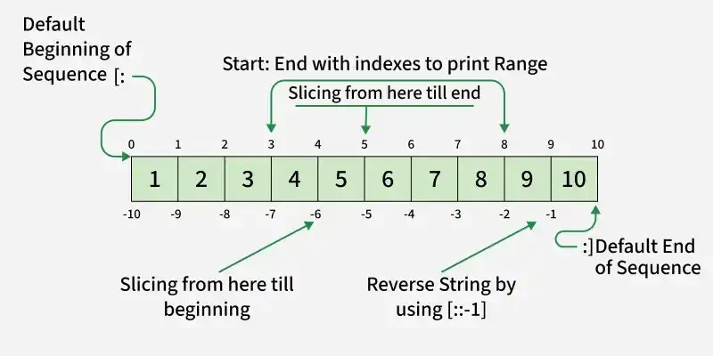

1. Creating
```python
a = []                                  # empty array
a = [1, 2, 3]                           # array with elements
a = [0] * 5                             # array with 5 zeros
a = list("abc")                         # ['a', 'b', 'c']
a = list(range(5))                      # [0, 1, 2, 3, 4]
```

2. Access & slicing
```python
a[0], a[-1]                             # first and last element - O(1)
a[i:j]                                  # subarray [i, j)
a[i:j:k]                                # subarray with step k
a[::-1]                                 # reversed array
a[i:j] = [7,8]                          # replace subarray (can redimension the array)
len(a)                                  # length of the array
```

3. Adding elements
```python
a.append(4)                             # add to the end - O(1)
a.extend([5, 6, 7])                     # add multiple elements to the end
a += [8, 9]                             # add multiple elements to the end
a.insert(i, 10)                         # insert at index i and shift elements to the right - O(n)
a = a + [11, 12]                        # create a new array with added elements
```

4. Removing elements - O(n)
```python
a.pop()                                 # remove & return last element
a.pop(i)                                # remove & return element at index i
a.remove(3)                             # remove first occurrence of value 3
del a[i]                                # remove element at index i
del a[i:j]                              # remove subarray [i, j)
a.clear()                               # empty the array
```

5. Searching
```python
x in a                                  # check if x is in the array
a.index(x)                              # first index of x (raises ValueError if not found)
a.index(x, start, end)                  # first index of x in the subarray [start, end)
a.count(x)                              # occurrences of x
min(a)                                  # minimum value
max(a)                                  # maximum value
sum(a)                                  # sum of all elements
```

6. Sorting & reversing
```python
a.sort()                                # sort in place
a.sort(reverse=True)                    # sort in descending order
b = sorted(a)                           # return a new sorted array
a.sort(key=len)                         # sort by length of elements
a.sort(key=lambda p: p[1])              # sort by second element of each subarray
a.sort(key=lambda p: (p[1], p[0]))      # sort by second element, then first
a.reverse()                             # reverse in place
```

7. Iterating
```python
for x in a: ...                         # values - when you don't need the index
for i in range(len(a)): ...             # index only
for i, x in enumerate(a): ...           # index + value
for i, x in enumerate(a, start=1): ...  # index starting at 1
for x, y in zip(a, b): ...              # iterate over two arrays in parallel - stops at the SHORTER one
for x in reversed(a): ...               # iterate in reverse order
for i in range(len(a)-1, -1, -1): ...   # iterate in reverse order using index
```

8. Comprehensions
```python
[x * x for x in a]                      # squares of elements
[x for x in a if x % 2 == 0]            # even elements
[x * 2 for x in a if x > 0]             # double positive elements
[x if x > 0 else 0 for x in a]          # replace negative elements with 0
[(i, x) for i, x in enumerate(a)]       # index + value pairs
[[0] * cols for _ in range(rows)]       # 2D array of zeros
sum(x for x in a if x > 0)              # sum of positive elements
any(x < 0 for x in a)                   # True if at least one element is negative
all(x < 0 for x in a)                   # True if all elements are negative
```

9. Unpacking & swapping
```python
a[i], a[j] = a[j], a[i]                 # swap elements
```

---

### Linked List

Python has no built-in linked list - you define the node.

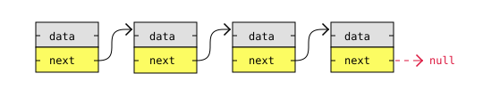

1. Creating
```python
class Node:
    def __init__(self, data):
        self.data = data
        self.next = None
```

2. Building
```python
node1 = Node(7)
node2 = Node(11)
node3 = Node(3)
node4 = Node(2)
node5 = Node(9)

node1.next = node2
node2.next = node3
node3.next = node4
node4.next = node5
```

3. Traversing
```python
cur = head
while cur:                              # stops when cur is None (past the last node)
    cur = cur.next
while cur and cur.next:                 # stops ON the last node
    cur = cur.next
```

4. Inserting
```python
node.next = prev.next                   # link the new node to the rest
prev.next = node                        # then link prev to it
```

5. Deleting
```python
prev.next = prev.next.next              # unlink the node AFTER prev - O(1)
```

6. Size
```python
n, cur = 0, head
while cur:
    n += 1
    cur = cur.next
```

---

### String

Strings are **immutable**. Every "modification" creates a new string.

1. Creating & converting
```python
s = ""                                  # empty string
s = "hello"                             # string with characters
s = str(123)                            # convert number to string
s = "ab" * 3                            # "ababab"
chars = list(s)                         # ['a', 'b', 'a', 'b', 'a', 'b']
s = " ".join(chars)                     # "a b a b a b"
```

2. Access & slicing
```python
s[0], s[-1]                             # first and last character
s[i:j]                                  # substring [i, j)
s[i:j:k]                                # substring with step k
s[:i], s[i:]                            # prefix / suffix
s[::-1]                                 # reversed string
len(s)                                  # length
s[i] = x                                # TypeError - strings are immutable
```

3. Searching
```python
"ab" in s                               # check if the substring is in the string
s.find("ab")                            # first index of substring, -1 if absent
s.rfind("ab")                           # last index of substring, -1 if absent
s.count("ab")                           # occurrences of substring
s.startswith("ab")                      # True if the string starts with substring
s.endswith("ab")                        # True if the string ends with substring
```

4. Transforming
```python
s.lower()                               # lowercase
s.upper()                               # uppercase
s.strip()                               # trim whitespace from both ends
s.strip(".,!")                          # trim any of these chars
s.lstrip(), s.rstrip()                  # trim one side only
s.replace("a", "b")                     # replace ALL occurrences of "a" with "b"
s.replace("a", "b", 1)                  # replace the first occurrence of "a" with "b"
```

5. Character checks & codes
```python
c.isalpha()                             # True if c is a letter
c.isdigit()                             # True if c is a digit
c.isalnum()                             # True if c is a letter or digit
c.isupper(), c.islower()                # True if c matches the case
ord(c)                                  # character -> UNICODE
chr(n)                                  # UNICODE -> character
```

6. Splitting
```python
s.split()                               # split on whitespace "mere pere banane" -> ['mere', 'pere', 'banane']
s.split(',')                            # split on ","
s.split(',', 1)                         # split at most once
s.rsplit(',', 1)                        # split from the right
```

7. Building strings
```python
s += c                                  # O(n) each time - O(n^2) in a loop, AVOID
parts = []                              # build in a list instead...
parts.append(c)
s = "".join(parts)
```

---

### Stack

**LIFO** - last in, first out.

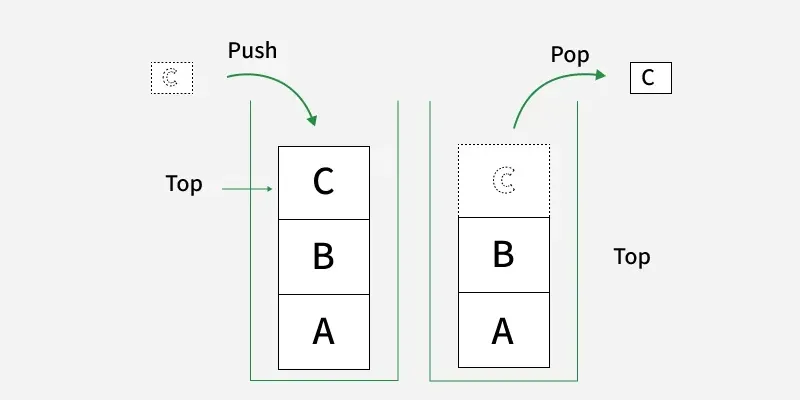

1. Creating
```python
s = []                                  # empty stack
s = [1, 2, 3]                           # stack with elements, 3 is the TOP of the stack
```

2. Push, pop & peek
```python
s.append(x)                             # push onto the top - O(1)
s.pop()                                 # remove & return the top - O(1)
s[-1]                                   # peek at the top, without removing
```

3. Checking
```python
if not s: ...                           # empty check
while s: ...                            # drain the stack
len(s)                                  # current size
```

---

### Queue & Deque

**FIFO** - first in, first out. Never use a list because `list.pop(0)` is O(n), `deque` is **O(1)** at both ends.

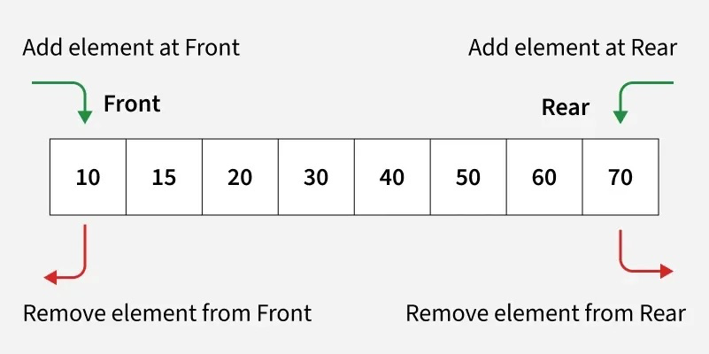

1. Creating
```python
from collections import deque
q = deque()                             # empty queue
q = deque([1, 2, 3])                    # 1 is the FRONT, 3 is the BACK
q = deque(maxlen=3)                     # fixed size - pushing drops the opposite end element
```

2. Adding & removing
```python
q.append(x)                             # add to the BACK - O(1)
q.appendleft(x)                         # add to the FRONT - O(1)
q.pop()                                 # remove & return the BACK - O(1)
q.popleft()                             # remove & return the FRONT - O(1)
q.extend([1,2,3])                       # add more elements to the back
q.extendleft([1,2,3])                   # add more elements to the front
```

1. Peeking & checking
```python
q[0]                                    # peek at the front
q[-1]                                   # peek at the back
if not q: ...                           # empty check
while q: ...                            # drain the queue
len(q)                                  # current size
```

1. Rotating
```python
q.rotate(1)                             # move everything right by 1
q.rotate(-1)                            # move everything left by 1
```

---

### Matrix

1. Creating
```python
grid = [[0] * cols for _ in range(rows)]  # works because the expression `[0] * cols` is evaluated once per iteration, creating a new list each time
```
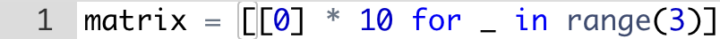
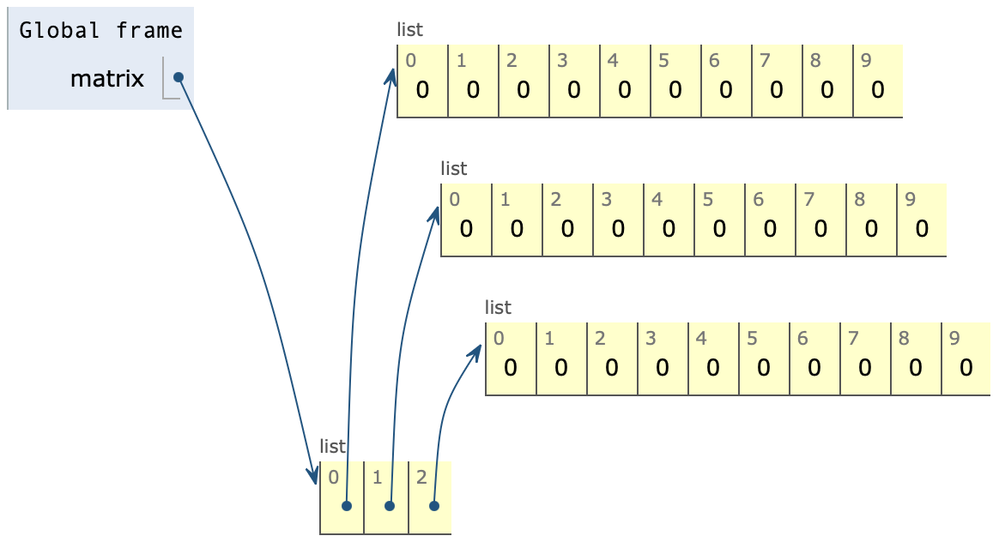

2. The `[[0] * cols] * rows` trap
```python
grid = [[0] * 10] * 3                   # First, `[0] * 10` creates a first list with 10 references to `0`.
                                        # This is safe because integers are immutable.
                                        #
                                        # Then, the outer `* 3` creates a second list with 3 references to the same first list. The first list is mutable, so modifying an element in it will be visible "through every list" referenced by the second list.
```
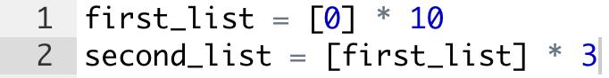
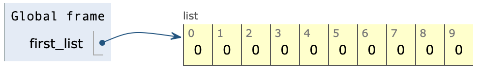
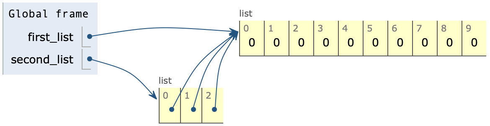

---

### Hash Map

A hash map stores key-value pairs and allows an average of **O(1)** insert, lookup and delete. Keys are **unique** and **immutable**.

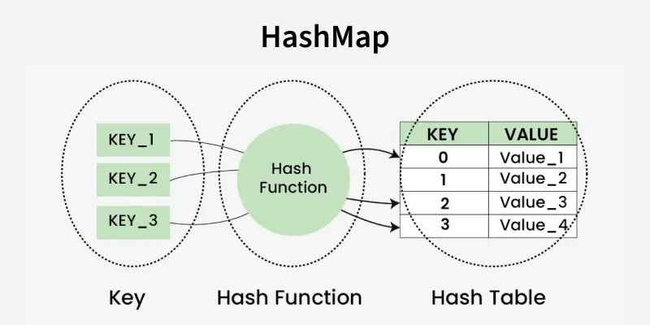

1. Creating
```python
d = {}                                  # empty dict
d = {"a": 1, "b": 2}                    # dict with key -> value pairs
d = dict(zip(keys, vals))               # build from two lists
d = {x: 0 for x in a}                   # comprehension

from collections import defaultdict
d = defaultdict(int)                    # missing key -> 0
d = defaultdict(list)                   # missing key -> []
d = defaultdict(set)                    # missing key -> set()

from collections import Counter
c = Counter("aabbc")                    # {'a': 2, 'b': 2, 'c': 1}
```

2. Access & updating
```python
d[k]                                    # value at key k (raises KeyError if absent)
d.get(k)                                # value at key k, None if absent
d.get(k, 0)                             # value at key k, 0 if absent
d[k] = v                                # insert or overwrite
d[k] = d.get(k, 0) + 1
d.setdefault(k, []).append(v)           # value at key k, creates an empty list and stores it in the dictionary at key k if absent
d.update(other)                         # merge another dictionary into d (d = {'a': 1, 'b': 2}; other = {'b': 20, 'c': 3}; d.update(other) -> {'a': 1, 'b': 20, 'c': 3})
```

3. Removing
```python
del d[k]                                # remove key (raises KeyError if absent)
d.pop(k)                                # remove & return value (raises KeyError if absent)
d.pop(k, None)                          # remove & return value, None if absent
d.popitem()                             # remove & return the last inserted key-value pair as a tuple (raises KeyError if absent)
d.clear()                               # empty the dict
```

4. Searching
```python
k in d                                  # check if the Key exists - O(1)
v in d.values()                         # check if the Value exists - O(n)
len(d)                                  # number of keys
max(d, key=d.get)                       # key with the largest value
sum(d.values())                         # sum of all values
sorted(d)                               # dictionary sorted by keys
sorted(d, key=d.get)                    # dictionary sorted by values
```

5. Iterating
```python
for k in d: ...                         # keys
for v in d.values(): ...                # values
for k, v in d.items(): ...              # key value
```

6. Counter
```python
c = Counter("banana")
c.most_common()                         # returns the items with the largest counts, ordered from most frequent to least frequent [('a', 3), ('n', 2), ('b', 1)]
c.most_common(2)                        # returns only the top 2 items with the largest counts [('a', 3), ('n', 2)]
```

---

### Hash Set

Set is a built-in Python data type that stores only unique elements, duplicate values are automatically removed. It is an unordered collection that supports **O(1)** add, lookup and remove.

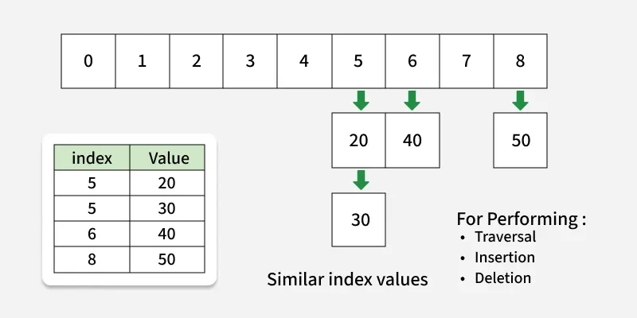

1. Creating
```python
s = set()                               # empty set
s = {1, 2, 3}                           # set with elements
s = set("hello")                        # {'h', 'e', 'l', 'o'}
s = {e for e in a if e > 0}             # comprehension
```

1. Adding & removing
```python
s.add(x)                                # add one element, no operation if already exists
s.update([1, 2, 3])                     # add many elements
s.remove(x)                             # remove (raises KeyError if absent)
s.discard(x)                            # remove, silently ignores if absent
s.pop()                                 # remove & return an ARBITRARY element (raises KeyError if absent)
s.clear()                               # empty the set
```

1. Searching
```python
x in s                                  # O(1)
x not in s
len(s)                                  # number of elements
min(s), max(s)                          # smallest / largest
sorted(s)                               # returns a sorted LIST
```

1. Set algebra
```python
s1 & s2                                 # intersection - in BOTH
s1 | s2                                 # union - in EITHER
s1 - s2                                 # difference - in s1 but not s2
s1 ^ s2                                 # symmetric difference - in exactly one
s1 <= s2                                # True if s1 is a subset of s2
s1 >= s2                                # True if s1 is a superset of s2
s1.isdisjoint(s2)                       # True if they share nothing
```

1. Iterating
```python
for x in s: ...                         # arbitrary order - never rely on it
for x in sorted(s): ...                 # sorted order
```

---

### Binary Tree

Data structure where each node has at most two children. Python has no built-in binary tree - you define the node.

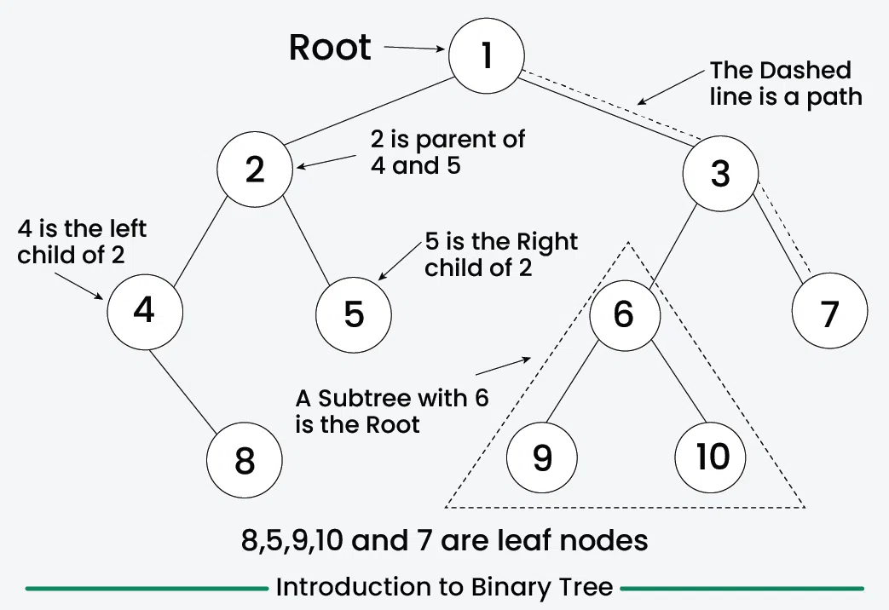

1. The node
```python
class TreeNode:
    def __init__(self, val=0, left=None, right=None):
        self.val = val                  # the payload
        self.left = left                # left child, None if absent
        self.right = right              # right child, None if absent
```

2. Building
```python
# Step by step
root = TreeNode(1)
root.left = TreeNode(2)
root.right = TreeNode(3)

# All at once
root = TreeNode(1, TreeNode(2), TreeNode(3))
```

3. Height & size
```python
def height(node):
    if not node: return 0
    return 1 + max(height(node.left), height(node.right))

def count(node):
    if not node: return 0
    return 1 + count(node.left) + count(node.right)
```

---

### Binary Search Tree

Same as a binary tree, plus one rule that makes it searchable: 
```python
        8            For EVERY node:
       / \             everything in the LEFT subtree  < node.val
      3   10           everything in the RIGHT subtree > node.val
     / \    \
    1   6    14
```

Every operation walks a single root-to-leaf path, so everything is O(h) when balanced, O(n) when degenerate. Python has no built-in BST.

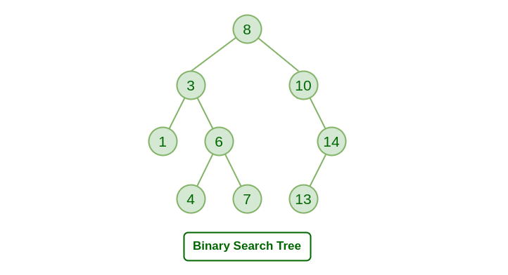

1. Creating
```python
class TreeNode:
    def __init__(self, val=0, left=None, right=None):
        self.val = val                  # the payload
        self.left = left                # left child, None if absent
        self.right = right              # right child, None if absent
```

2. Search - O(h)
```python
def search(node, target):
    while node:
        if target == node.val:
            return node
        node = node.left if target < node.val else node.right
    return None
```

3. Insert - O(h)
```python
def insert(node, val):
    if not node: return TreeNode(val)   # empty spot
    if val < node.val:
        node.left = insert(node.left, val)
    else:
        node.right = insert(node.right, val)
    return None                         # not found
```

4. Delete - three cases
```python
def delete(node, val):
    if not node: return None
    if val < node.val:
        node.left = delete(node.left, val)
    elif val > node.val:
        node.right = delete(node.right, val)
    else:
        # 0 or 1 child
        if not node.left: return node.right
        if not node.right: return node.left
        # 2 children: replace with the smallest value on the right
        succ = node.right
        while succ.left:
            succ = succ.left
        node.val = succ.val # copy the successor's value up
        node.right = delete(node.right, succ.val) # delete the duplicate
    return node
```
```python
# deleting 50 - the 2 children case
root = delete(root, 50)
```
```
      50                      60                       60
     /  \                    /  \      delete         /  \
    30    70    copy        30    70     duplicate   30    70
        /  \    ------>          / \     ------>            \
      60    80                 60   80                      80
```

5. Min & max - O(h)
```python
while node.left: node = node.left # leftmost node is the smallest value
while node.right: node = node.right # rightmost node is the biggest value
```

---

### Heap / Priority Queue

Min-heaps are complete binary trees, implemented using lists for which `heap[k] <= heap[2*k+1]` and `heap[k] <= heap[2*k+2]` for all k for which the compared elements exist. Elements are counted from zero, so the smallest element is always the root, `heap[0]`.

Max-heaps satisfy the reverse invariant - `heap.sort(reverse=True)` maintains it. Python's heap is **min-only**.

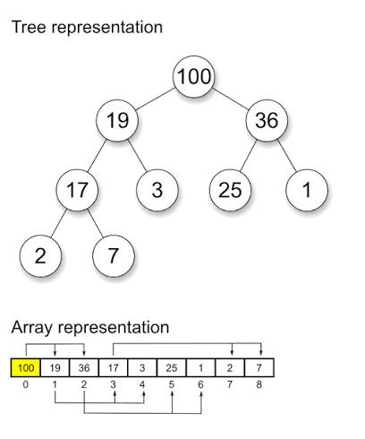

1. Creating
```python
import heapq
# Min-heap
h = []                                  # a plain list IS the heap
a = [5, 1, 8, 3, 9, 2]
heapq.heapify(a)                        # turns the array a into a valid min-heap, in place O(n) ([5, 1, 8, 3, 9, 2] -> [1, 3, 2, 5, 9, 8])

# Max-heap
h = []
a = [5, 1, 8, 3, 9, 2]
h = [-x for x in a]
heapq.heapify(h)
```

2. Push, pop & peek
```python
heapq.heappush(h, x)                    # insert - O(log n)
heapq.heappop(h)                        # remove & return the SMALLEST - O(log n)
h[0]                                    # peek at the smallest - O(1)
```

3. Checking
```python
if not h: ...                           # empty check
while h: ...                            # drain the heap
len(h)                                  # current size
```

4. Max-heap - Python doesn't have one
```python
heapq.heappush(h, -x)                   # push the negative
-heapq.heappop(h)                       # negate again on the way out
```

5. Heap of tuples - order by a custom key
```python
heapq.heappush(h, (dist, node))         # orders by dist, then by node
dist, node = heapq.heappop(h)           # unpack when popping
```

---

### Graph

A graph is consisted of vertices (nodes) and edges (lines). Two of the most common ways to store a graph are:
• Adjancecy List Representation 
• Adjacency Matrix Representation

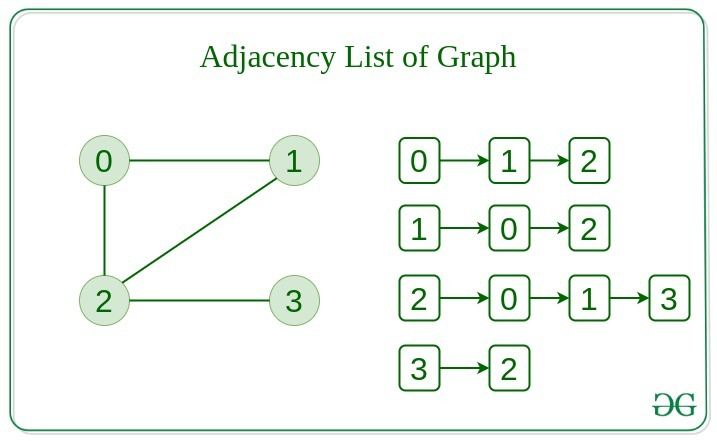
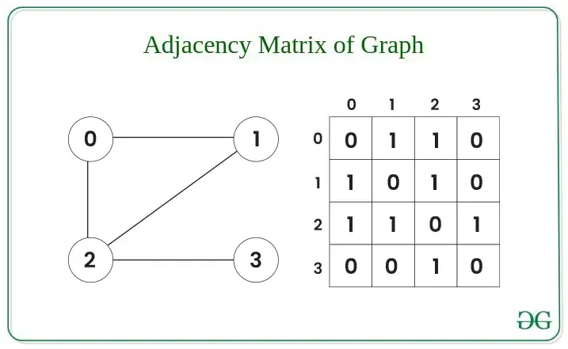

1. Adjacency list - the default, use this unless told otherwise
```python
from collections import defaultdict
g = defaultdict(list)
for u, v in edges:
    g[u].append(v)
    g[v].append(u)
```

2. Adjacency matrix - when the graph is dense
```python
m =[[0] * n for _ in range(n)]          # m[u][v] = 1 if the edge exists
m[u][v] = 1                             # directed 
m[u][v] = m[v][u] = 1                   # undirected
```

3. Visiting neighbors
```python
for v in g[u]: ...                      # adjacency list
for v in range(n):                      # adjacency matrix
    if m[u][v]: ...
```

4. DFS
```python
# Recursive
seen = set()
def dfs(u):
    if u in seen: return                # already visited - stop
    seen.add(u)
    for v in g[u]:
        dfs(v)
```
```python
# Iterative
stack, seen = [start], {start}
while stack:
    u = stack.pop()
    for v in g[u]:
        if v not in seen:
            seen.add(v)
            stack.ppend(v)
```

5. BFS
```python
q, seen = deque([start]), {start}
while q:
    u = q.pop()
    for v in g[u]:
        if v not in seen:
            seen.add(v)
            q.append(v)
```


---

### Trie

A trie consists of nodes connected by edges. Each node repesents a character or a part of a string. The root node acts as a starting point and does not store any character.


1. Creating
```python
class TrieNode:
    def __init__(self):
        self.children = {}
        self.is_word = False

class Trie:
    def __init__(self):
        self.root = TrieNode()
```

2. Insert - O(h)
```python
def insert(self, word):
    node = self.root
    for c in word:
        if c not in node.children:      # no branch for this char yet
            node.children[c] = TrieNode()
        node = node.children[c]
    node.is_word = True                 # mark where the word ENDS
```

3. Walk
```python
def walk(self, prefix):
    node = self.root
    for c in prefix:
        if c not in node.children:
            return None                 # prefix isn't in the trie at all
        node = node.children[c]
    return node
```

4. Search & startsWith
```python
def search(self, word):
    node = self.walk(word)
    # the path must exist AND be marked as a word ending
    return node is not None and node.is_word
```
```python
def startsWith(self, prefix)
    # the path existing is enough
    return self.walk(prefix) is not None
```

## Algorithms

---

### Two Pointers Technique

Two indexes walking a sequence, replacing a nested loop. Turns O(n^2) -> O(n), but needs the input **sorted**.

```python
l, r = 0, len(a) - 1                    # start at both ends
while l < r:                            # stop when they meet
    if a[l] + a[r] == target:
        return True
    elif a[l] + a[r] < target:          # too small -> need a bigger number
        l += 1
    else:                               # too big -> need a smaller number
        r -= 1
```
